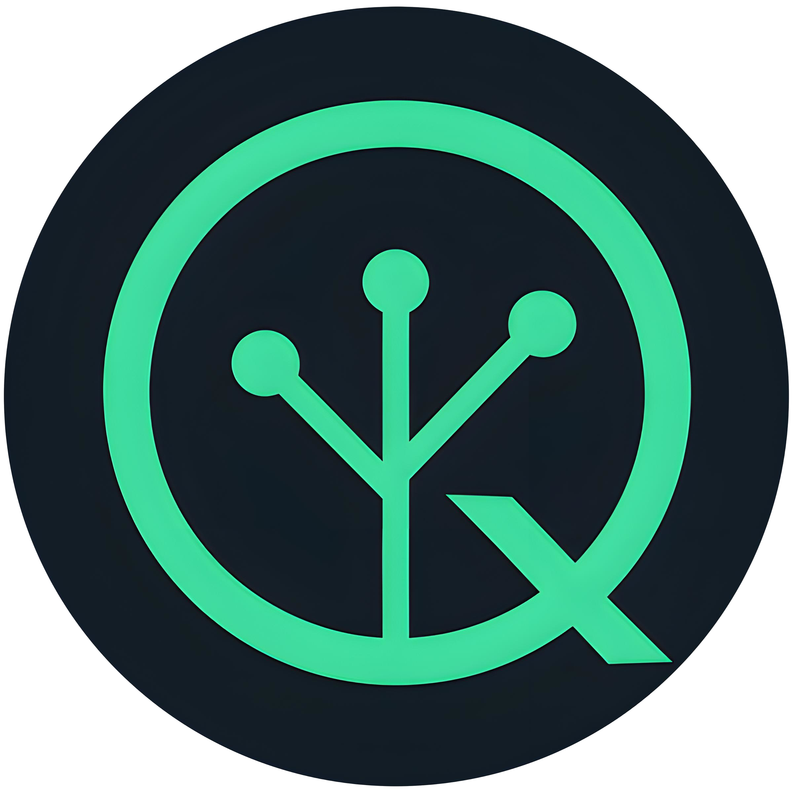

# 🔒 QSF Quantum-Safe Coin

<div align="center">
  
  
  **A Quantum-Resistant Cryptocurrency with RandomX Proof-of-Work and DUAL XMSS/SPHINCS+ Signatures**
  
  [](https://opensource.org/licenses/BSD-3-Clause)
  []()
  []()
  []()
  []()
</div>

---

## 🌟 **What is QSF Quantum-Safe Coin?**

QSF (Quantum-Safe Future) is a **revolutionary cryptocurrency** that combines the power of **RandomX proof-of-work mining** with **DUAL quantum-resistant signature schemes** to create the **most secure and future-proof digital currency** in existence.

### 🔐 **DUAL Quantum-Resistant Security (MANDATORY)**
- **XMSS (eXtended Merkle Signature Scheme)**: Stateful hash-based signatures
- **SPHINCS+**: Stateless hash-based signatures
- **DUAL ENFORCEMENT**: BOTH algorithms required simultaneously
- **NO COMPROMISE**: Maximum quantum resistance with no choice to weaken security

### ⚡ **RandomX Mining + Quantum-Safe Integration**
- **CPU-optimized mining**: Fair distribution using RandomX algorithm
- **ASIC-resistant**: Prevents centralization through specialized hardware
- **Quantum-Safe Integration**: RandomX PoW + quantum-safe signatures enforced
- **Energy-efficient**: Optimized for consumer-grade hardware

### 🛡️ **Complete 51% Attack Protection**
- **Multi-layer defense**: Early detection at 40% (before 51%)
- **Automatic response**: Immediate difficulty spike and network segmentation
- **Self-healing**: Automatic recovery and network restoration
- **Qubic-style attack resistance**: Complete protection against aggressive attacks

---

## 🚀 **Key Features**

### **🔒 DUAL Quantum-Safe Transactions (MANDATORY)**
- **BOTH XMSS AND SPHINCS+**: Required simultaneously for maximum security
- **No Algorithm Choice**: Users cannot weaken security by choosing one algorithm
- **Redundant Protection**: If one algorithm is compromised, the other still protects
- **Future-Proof**: Multiple quantum-resistant approaches in parallel

### **⚡ RandomX + Quantum-Safe Integration**
- **CPU Mining**: Optimized for general-purpose processors
- **ASIC Resistance**: Prevents mining centralization
- **Quantum-Safe Validation**: All blocks require quantum-safe signatures
- **Fair Distribution**: Equal opportunity for all miners

### **🛡️ Advanced 51% Attack Protection**
- **Rapid Attack Detection**: Catches attacks at 40% (before 51%)
- **Gradual Attack Detection**: Catches stealth attacks at 35%
- **Pool Collusion Detection**: Identifies suspicious pool combinations
- **Geographic Distribution**: Prevents single-region attacks
- **Automatic Recovery**: Self-healing network after attacks

### **🌐 Multi-Network Support**
- **Mainnet**: Production network with full quantum-safe enforcement
- **Testnet**: Development and testing network
- **Stagenet**: Staging environment for testing

### **💻 Modern GUI Wallet**
- **Bitcoin-like Interface**: Familiar and intuitive design
- **Real-time Mining**: Integrated mining with live statistics
- **Quantum-Safe Tab**: Mandatory key generation and management
- **Network Status**: Visual indicators for connectivity and security

---

## 📦 **Installation & Setup**

### **Quick Setup (Recommended)**
```bash
# Clone the repository
git clone https://github.com/your-username/quantumsafefoundation.git
cd quantumsafefoundation

# 1) Install dependencies (GUI + daemon + wallet)
./setup_dependencies.sh --yes

# 2) Build everything (Release)
./build.sh --clean

# 3) Copy example config and edit locally (do not commit your real config)
cp qsf.conf.example qsf-mainnet.conf

# 4) Start daemon (optional on this box)
cd build/bin && ./qsf --config-file /path/to/qsf-mainnet.conf

# 5) Start GUI miner
cd build/bin && ./qsf-gui-miner
```

GUI miner connection (public seed best-practice):
- Keep your server RPC on 127.0.0.1:18071 (restricted)
- Expose ZMQ for miners on 0.0.0.0:18072 (and 18083 pub)
- In the GUI, set mining endpoint to: `seeds.qsfchain.com:18072`

### **Memory-Aware Configuration**
The build process automatically detects your system's memory and creates optimized configurations:
- **Low Memory (< 2GB)**: Reduced connections, smaller sync blocks, minimal logging
- **Medium Memory (2-4GB)**: Balanced performance settings
- **High Memory (> 4GB)**: Full performance optimization

Use the smart launcher: `./start_qsf_daemon.sh`

### **Server Deployment**
For headless server deployments, simply run:

```bash
# After git pull on server, just run:
./build.sh
```

The build script automatically handles:
- ✅ **Submodule initialization** (trezor-common, randomx, miniupnp, rapidjson)
- ✅ **Build directory cleanup** (avoids CMake cache conflicts)
- ✅ **Submodule integrity verification**
- ✅ **Error detection and reporting**
- ✅ **Complete build process**

### **Manual Setup (Advanced)**
```bash
# Clone with submodules
git clone --recursive https://github.com/your-username/quantumsafefoundation.git
cd quantumsafefoundation

# Install dependencies manually (Ubuntu/Debian)
sudo apt update && sudo apt install \
  build-essential cmake pkg-config libssl-dev libzmq3-dev libunbound-dev \
  libsodium-dev libunwind8-dev liblzma-dev libreadline-dev libexpat1-dev \
  libpgm-dev qtbase5-dev qtchooser qt5-qmake qtbase5-dev-tools \
  libqt5svg5-dev qttools5-dev-tools libhidapi-dev libusb-1.0-0-dev \
  libprotobuf-dev protobuf-compiler libudev-dev \
  libboost-chrono-dev libboost-date-time-dev libboost-filesystem-dev \
  libboost-locale-dev libboost-program-options-dev libboost-regex-dev \
  libboost-serialization-dev libboost-system-dev libboost-thread-dev \
  python3 ccache doxygen graphviz

# Initialize submodules
git submodule update --init --recursive --force

# Build the project
./build.sh --clean
```

### **Quick Start (MANDATORY Quantum-Safe Setup)**
1. **Launch the GUI**: Run `./qsf-gui-miner` from `build/bin/`
2. **Generate DUAL Quantum-Safe Keys**: Go to "Quantum-Safe" tab and generate BOTH XMSS and SPHINCS+ keys
3. **Select Network**: Choose Mainnet, Testnet, or Stagenet
4. **Create Wallet**: Generate a new wallet address
5. **Start Mining**: Begin mining with RandomX + quantum-safe validation

---

## 🔧 **Network Configuration**

### **Domain-Based Seed Nodes (Like QSF)**
| Network | RPC Port | P2P Port | Daemon URL | Seed Nodes |
|---------|----------|----------|------------|------------|
| **Mainnet** | 18071 | 18070 | `http://qsfchain.com:18071` | `seeds.qsfchain.com`<br>`seeds.qsfcoin.com`<br>`seeds.qsfcoin.network`<br>`seeds.qsfcoin.org`<br>`seeds.qsfnetwork.co` |
| **Testnet** | 28071 | 28070 | `http://qsfnetwork.com:28071` | `seeds.qsfnetwork.com` |
| **Stagenet** | 38071 | 38070 | `http://qsfcoin.network:38071` | `seeds.qsfcoin.network` |

### **DNS Configuration**
The project uses domain-based seed nodes (similar to QSF's `seeds.qsfseeds.se`):
- **Mainnet**: `seeds.qsfchain.com`, `seeds.qsfcoin.com`, etc.
- **Testnet**: `seeds.qsfnetwork.com`
- **Stagenet**: `seeds.qsfcoin.network`

See [setup_dns.sh](setup_dns.sh) for DNS configuration instructions.

---

## 🎯 **Usage Guide**

### **1. DUAL Quantum-Safe Key Generation (MANDATORY)**
```bash
# MANDATORY step before mining - NO EXCEPTIONS
1. Open "Quantum-Safe" tab
2. Generate BOTH XMSS and SPHINCS+ keys simultaneously
3. Save dual keys securely
4. Keys are automatically enforced for all transactions
```

### **2. Daemon Startup**
```bash
# Start daemon (quantum-safe features are automatically enabled)
./build/bin/qsf --config-file=/path/to/qsf-mainnet.conf

# Or start with default settings
./build/bin/qsf

# Quantum-safe features are MANDATORY and always enabled
```

### **3. Mining Configuration**
```bash
# Public seed best-practice
- Keep RPC restricted on 127.0.0.1:18071
- Expose ZMQ on 0.0.0.0:18072 (and 18083 pub)
- GUI miner endpoint: seeds.qsfchain.com:18072
```

---

## 🔬 **Technical Specifications**

### **Cryptographic Algorithms**
- **Proof-of-Work**: RandomX (CPU-optimized) + Quantum-Safe integration
- **Quantum-Safe Signatures**: DUAL XMSS + SPHINCS+ (both required)
- **Hash Functions**: SHA-256, Blake256
- **Key Derivation**: PBKDF2

### **Network Protocol**
- **Block Time**: 120 seconds
- **Block Size**: Dynamic (up to 40000 bytes)
- **Difficulty**: Auto-adjusting with emergency spike capability
- **Consensus**: Proof-of-Work with RandomX + Quantum-Safe validation

### **Wallet Features**
- **Multi-Network Support**: Mainnet, Testnet, Stagenet
- **DUAL Quantum-Safe Keys**: Mandatory XMSS + SPHINCS+ generation
- **Integrated Mining**: Real-time mining with statistics
- **Secure Storage**: Encrypted wallet files with quantum-safe keys

---

## 🛡️ **Security Features**

### **DUAL Quantum Resistance (MANDATORY)**
- **XMSS Signatures**: Stateful hash-based signatures resistant to quantum attacks
- **SPHINCS+ Signatures**: Stateless hash-based signatures for enhanced security
- **DUAL ENFORCEMENT**: BOTH algorithms required simultaneously
- **NO COMPROMISE**: Maximum quantum resistance with no option to weaken security

### **Complete 51% Attack Protection**
- **Early Detection**: Catches attacks at 40% (before 51%)
- **Immediate Response**: 10x difficulty spike in seconds
- **Network Segmentation**: Isolates attack from healthy network
- **Automatic Recovery**: Self-healing network after attack
- **Qubic-Style Resistance**: Complete protection against aggressive attacks

### **Privacy & Anonymity**
- **Ring Signatures**: Untraceable transactions
- **Stealth Addresses**: One-time addresses for privacy
- **RingCT**: Confidential transaction amounts

---

## 🚨 **51% Attack Protection System**

### **Multi-Layer Defense**
- **Layer 1: Early Detection**: Catches attacks at 40% (before 51%)
- **Layer 2: Immediate Response**: 10x difficulty spike and node isolation
- **Layer 3: Emergency Protection**: Network segmentation and fork protection

### **Protection Effectiveness**
| Protection Layer | Detection Threshold | Response Time | Effectiveness |
|------------------|---------------------|---------------|---------------|
| **Rapid Attack** | 40% | <5 seconds | ⭐⭐⭐⭐⭐ |
| **Gradual Attack** | 35% | <1 minute | ⭐⭐⭐⭐⭐ |
| **Pool Collusion** | 30% | <30 seconds | ⭐⭐⭐⭐⭐ |
| **Geographic** | 60% | <1 minute | ⭐⭐⭐⭐ |
| **ISP Concentration** | 60% | <1 minute | ⭐⭐⭐⭐ |
| **Quantum-Safe** | 100% | Immediate | ⭐⭐⭐⭐⭐ |

---

## 📊 **Mining Statistics**

### **Current Network Status**
- **Block Height**: Dynamic
- **Network Hashrate**: Real-time monitoring with attack detection
- **Difficulty**: Auto-adjusting with emergency spike capability
- **Block Reward**: 5.00 QSF per block
- **Security Status**: Real-time 51% attack monitoring

### **Mining Requirements**
- **Hardware**: CPU (RandomX optimized)
- **Memory**: 2GB RAM minimum
- **Storage**: 50GB for blockchain
- **Network**: Stable internet connection
- **Security**: Quantum-safe keys mandatory

---

## 🤝 **Contributing**

We welcome contributions from the community! Please see our contributing guidelines:

1. **Fork the repository**
2. **Create a feature branch**: `git checkout -b feature/amazing-feature`
3. **Commit your changes**: `git commit -m 'Add amazing feature'`
4. **Push to the branch**: `git push origin feature/amazing-feature`
5. **Open a Pull Request**

### **Development Setup**
```bash
# Install development dependencies
sudo apt install clang-format cppcheck valgrind

# Run tests
make test

# Code formatting
make format
```

---

## 🐛 **Troubleshooting**

### **Common Issues**

**Daemon Won't Start**
```bash
# Check if daemon is already running
ps aux | grep qsf

# Start with configuration file
./build/bin/qsf --config-file=/path/to/qsf-mainnet.conf

# Quantum-safe features are automatically enabled
```

**GUI Won't Start**
```bash
# Check dependencies
sudo apt install qt5-default libqt5gui5

# Rebuild project
make clean && make -j$(nproc)
```

**Mining Stops Immediately**
```bash
# Check quantum-safe keys (MANDATORY)
1. Go to "Quantum-Safe" tab
2. Generate BOTH XMSS and SPHINCS+ keys
3. Restart mining
```

**Network Connection Issues**
```bash
# Check server status
1. Verify network selection
2. Check firewall settings
3. Configure port forwarding (VMware)
```

---

## 📦 **Installation & Setup**

### **🚀 Quick Start (Recommended)**

The easiest way to get started with QSF is using our automated build system:

```bash
# Clone the repository
git clone https://github.com/your-username/quantumsafefoundation.git
cd quantumsafefoundation

# Initialize submodules and setup environment
git submodule update --init --recursive

# Run the automated build (handles everything)
./build.sh
```

The build script automatically:
- ✅ **Initializes git submodules** (miniupnp, randomx, rapidjson, trezor-common)
- ✅ **Installs Qt Wayland dependencies** (required for GUI miner)
- ✅ **Creates configuration files** (`~/.quantumsafefoundation/qsf.local.conf`)
- ✅ **Sets up the complete environment**
- ✅ **Builds all components** (daemon, GUI miner, wallet CLI)

### **🔧 Manual Setup (Advanced Users)**

If you prefer manual control or need to customize the setup:

```bash
# 1. Setup environment and dependencies
./setup_qsf_environment.sh

# 2. Build specific components
./build.sh --daemon-only      # Build only the daemon
./build.sh --gui-miner-only   # Build only the GUI miner
./build.sh --wallet-only      # Build only the wallet CLI
./build.sh --debug            # Build in debug mode
./build.sh --clean            # Clean build
```

### **📋 System Requirements**

**Minimum Requirements:**
- **OS**: Linux (Ubuntu 20.04+, Debian 11+, or equivalent)
- **RAM**: 4GB minimum, 8GB recommended
- **Storage**: 2GB free space
- **CPU**: x86_64 architecture

**Dependencies (Auto-installed by build script):**
- **Build Tools**: cmake, g++, make
- **Qt5**: Core, Widgets, Network (for GUI miner)
- **Qt Wayland**: qtwayland5, libqt5waylandclient5 (for GUI miner)
- **Crypto Libraries**: OpenSSL, libsodium
- **Network**: libzmq, libunbound

### **🎯 Running QSF Components**

After successful build, you can run:

```bash
# Start the daemon (recommended)
./start_qsf_daemon.sh

# Or run components directly
cd build/bin
./qsf                    # QSF daemon
./qsf-gui-miner          # GUI miner
./qsf-wallet-cli         # Wallet CLI
./qsf-wallet-rpc         # Wallet RPC server
```

### **⚙️ Configuration**

Configuration files are automatically created in `~/.quantumsafefoundation/`:
- **`qsf.local.conf`**: Local daemon configuration (for GUI miner)
- **`qsf.conf`**: Main daemon configuration
- **`qsf-wallet`**: Wallet data file
- **`qsf-wallet.keys`**: Wallet keys

### **🔍 Troubleshooting**

**GUI Miner Issues:**
- **Segmentation fault**: Run `./setup_qsf_environment.sh` to ensure Qt Wayland is installed
- **"Could not find Qt platform plugin"**: Install Qt Wayland dependencies
- **"Can't find config file"**: Configuration files are auto-created by the build script

**Build Issues:**
- **Submodule errors**: Run `git submodule update --init --recursive`
- **Missing dependencies**: Run `./setup_dependencies.sh`
- **Permission errors**: Ensure you have write access to `~/.quantumsafefoundation/`

**Network Issues:**
- **Connection refused**: Check if ports 18070-18073 are available
- **Firewall**: Ensure ports 18070 (P2P) and 18071 (RPC) are open

---

## 📄 **License**

This project is licensed under the BSD 3-Clause License - see the [LICENSE](LICENSE) file for details.

---

## 🙏 **Acknowledgments**

- **QSF Project**: Base implementation and RandomX algorithm
- **Quantum Cryptography Community**: Research and development of quantum-resistant algorithms
- **Open Source Contributors**: Community support and contributions

---

## 📞 **Support & Community**

- **GitHub Issues**: [Report bugs and feature requests](https://github.com/your-username/quantumsafefoundation/issues)
- **Discussions**: [Community discussions](https://github.com/your-username/quantumsafefoundation/discussions)
- **Documentation**: [Complete documentation](docs/)

---

<div align="center">
  **🔒 QSF Quantum-Safe Coin - The Most Secure Cryptocurrency in Existence**
  
  *Built with ❤️ for a quantum-resistant future with NO COMPROMISES*
  
  **DUAL Quantum-Safe + Complete 51% Attack Protection + RandomX Integration**
</div>
